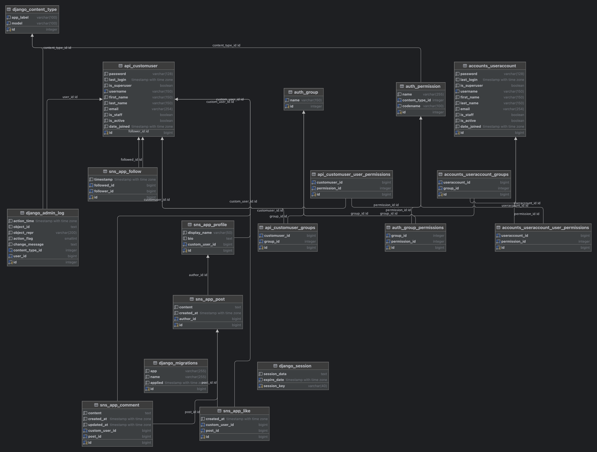

##### （認証）dj_rest_auth　←　Django-rest-auth に伴い、認証関連は、更新中です。
##### With the migration of the library from Django-rest-auth to dj_rest_auth, the authentication-related aspects of this project are being updated.
"Thanks to everyone at Django-rest-auth for their support. To those who forked Django-rest-auth and are developing "dj_rest_auth", thank you!

### [django_rest_sns]プロジェクト

- 本プロジェクトは、（sns_appアプリ、accountsアプリ、apiアプリ）と(DB環境：Docker、UnitTest、他)で構成されています。

##### ER図

- python manage.py graph_models -a -g -o er.png
- 

##### [1] sns_appアプリ

- ソーシャルネットワーク(SNS)の機能をRest_APIで、実現、提供します。
- 各機能をRESTfulなインターフェースが利用でき、
- ユーザーは このsns_app の機能を活用してソーシャルネットワーク上でのインタラクションを行うことができます。

##### [2] accountsアプリ

- acoountsの管理機能の提供。

##### [3] apiアプリ

- Django REST Framework で JWT認証システム(token認証)を実現。
- accountsのapi ー　API, メールにて、accountsの管理、(CRUD)登録、一覧、照会、更新、削除のAPIを提供しています。
- 認証方式： JWT(Simple Json Web Token) token認証
  - 開発(Debug設定)　メールはコンソールに表示する。（ローカルでテスト）
  - 本番設定：settings.pyでメール、メールサーバーの設定を有効化すること。
- アカウント管理（account/)
- API(api/)
- データベース(docker/)
  - docker-compose: PostgreSQL(本ソフトデフォルト）
    - dockerフォルダー/postgresql でPostgreSQL選択可能。
    - dockerフォルダー/mysql で、MySQL選択可能。
- Todo-Webアプリ(todo_task/)
- Todo-API

##### 認証・認可　API一覧・概要

- JWT SimpleJWTによるtoken認証を利用
- Djoserパッケージの利用

##### (1) 認証・認可　API一覧（認証・認可メール関連）

| 機能                       | URL                                                          |
| -------------------------- | ------------------------------------------------------------ |
| 1. アカウント仮登録        | http://localhost:8000/api/auth/users/                        |
| - tokenの取得              | http://localhost:8000/api/auth/jwt/create/                   |
| 2. アカウント本登録        | http://localhost:8000/api/auth/users/activation/             |
| 3. アカウント本登録再送信  | http://localhost:8000/api/auth/users/resend_activation/      |
| 4. ログイン                | http://localhost:8000/api/auth/jwt/create/                   |
| 5. リフレッシュトークン    | http://localhost:8000/api/auth/jwt/refresh/                  |
| 6. 認証チェック            | http://localhost:8000/api/auth/jwt/verify/                   |
| 7. ユーザー情報取得        | http://localhost:8000/api/auth/users/me/                     |
| 8. ユーザー情報変更        | http://localhost:8000/api/auth/users/me/                     |
| 9. ユーザーリスト取得      | http://localhost:8000/api/auth/users/                        |
| 10. メールアドレス変更     | (Djoserのデフォルトでは提供されていない)                     |
| 11. メールアドレス変更確認 | (Djoserのデフォルトでは提供されていない)                     |
| 12. パスワード変更         | http://localhost:8000/api/auth/users/set_password/           |
| 13. パスワードリセット     | http://localhost:8000/api/auth/users/reset_password/         |
| 14. パスワードリセット確認 | http://localhost:8000/api/auth/users/reset_password_confirm/ |
| 15. アカウント削除         | http://localhost:8000/api/auth/users/{username}/             |
| 16. アカウント削除確認     | (Djoserのデフォルトでは提供されていない)                     |

## 認証・認可　ユニットテスト

- [sns_appのAPI]

### sns_app の機能一覧

| 機能カテゴリ                   | 説明                                                                                                    |
| ------------------------------ | ------------------------------------------------------------------------------------------------------- |
| **プロファイル管理 (profile)** | ユーザーのプロファイル情報（表示名、自己紹介）の表示、作成、更新、削除。                                |
| **投稿機能 (post)**            | ユーザーによるテキスト投稿の作成、表示、更新、削除。投稿の所有者のみが編集や削除が可能。                |
| **いいね機能 (like)**          | ユーザーが投稿に対して「いいね」をつける。いいねの追加と削除。                                          |
| **コメント機能 (comment)**     | ユーザーが投稿に対してコメントをする。コメントの作成、表示、更新、削除。                                |
| **フォロー機能 (follow)**      | ユーザーが他のユーザーをフォロー/アンフォローする。フォローしているユーザーとフォロワーのリストの表示。 |

##### sns_app の API 一覧

- 以下のAPI エンドポイントが提供されており、各機能をRESTfulなインターフェースを通じて操作できます。
- ユーザーは このsns_app の機能を活用してソーシャルネットワーク上でのインタラクションを行うことができます。

| エンドポイント    | HTTPメソッド     | 説明                                 | パーミッション                     |
| ----------------- | ---------------- | ------------------------------------ | ---------------------------------- |
| `/profiles/`      | GET, POST        | プロファイルのリスト表示と作成       | 認証済みユーザー、所有者のみ更新可 |
| `/profiles/{id}/` | GET, PUT, DELETE | 特定のプロファイルの表示、更新、削除 | 認証済みユーザー、所有者のみ更新可 |
| `/posts/`         | GET, POST        | 投稿のリスト表示と作成               | 認証済みユーザー、所有者のみ更新可 |
| `/posts/{id}/`    | GET, PUT, DELETE | 特定の投稿の表示、更新、削除         | 認証済みユーザー、所有者のみ更新可 |
| `/likes/`         | GET, POST        | いいねのリスト表示と作成             | 認証済みユーザー                   |
| `/likes/{id}/`    | GET, DELETE      | 特定のいいねの表示と削除             | 認証済みユーザー                   |
| `/comments/`      | GET, POST        | コメントのリスト表示と作成           | 認証済みユーザー                   |
| `/comments/{id}/` | GET, PUT, DELETE | 特定のコメントの表示、更新、削除     | 認証済みユーザー                   |
| `/follows/`       | GET, POST        | フォロー関係のリスト表示と作成       | 認証済みユーザー                   |
| `/follows/{id}/`  | GET, DELETE      | 特定のフォロー関係の表示と削除       | 認証済みユーザー                   |

### accounts/email.py の機能一覧

| クラス名                           | 機能説明                                                                                                                                        |
| ---------------------------------- | ----------------------------------------------------------------------------------------------------------------------------------------------- |
| `EmailManager`                     | ベースとなるメール送信機能を提供し、メールの送信先、CC、BCC、返信先アドレス、送信元アドレスの設定を管理します。                                 |
| `ActivationEmail`                  | アカウントのアクティベーションリンクを含むメールを送信します。アクティベーションURL、ユーザーID、トークンを含むコンテキストデータを生成します。 |
| `ConfirmationEmail`                | アカウントの確認メールを送信します。ユーザー名を含む基本的なコンテキストデータを生成します。                                                    |
| `PasswordResetEmail`               | パスワードリセットリンクを含むメールを送信します。リセットURL、ユーザーID、トークンを含むコンテキストデータを生成します。                       |
| `PasswordChangedConfirmationEmail` | パスワードが変更されたことを通知するメールを送信します。ユーザー名を含む基本的なコンテキストデータを生成します。                                |
| `UsernameResetEmail`               | ユーザー名リセットリンクを含むメールを送信します。リセットURL、ユーザーID、トークンを含むコンテキストデータを生成します。                       |
| `UsernameChangedConfirmationEmail` | ユーザー名が変更されたことを通知するメールを送信します。ユーザー名を含む基本的なコンテキストデータを生成します。                                |

### メニュー/ コンテンツ一覧

1. API一覧
2. ER図
3. テーブル仕様・詳細
4. 初期データ（テスト用）の投入、順序 - fixtures-json
5. Unit Test

### （１）API一覧

- 認証・認可のAPI一覧（認証・認可メール関連）は前述を参照のこと。

### （２）ER図

- 

### （３）テーブル仕様・詳細

##### accounts/models.py のテーブル仕様書

1. UserAccountテーブル

| フィールド       | 型              | 説明                                                                               |
| ---------------- | --------------- | ---------------------------------------------------------------------------------- |
| email            | EmailField      | ユーザーのメールアドレス。ユーザーネームとして使用されます。                       |
| password         | CharField       | ユーザーパスワード（ハッシュ値）。                                                 |
| groups           | ManyToManyField | ユーザーが属するグループ。各グループが持つパーミッションがユーザーにも適用される。 |
| user_permissions | ManyToManyField | ユーザーに割り当てられた具体的なパーミッション。                                   |

##### api/models.py のテーブル仕様書

2. api/models

| フィールド       | 型       | 説明                                                                                     |
| ---------------- | -------- | ---------------------------------------------------------------------------------------- |
| (標準フィールド) | (標準型) | AbstractUser を継承しており、Django の標準ユーザーモデルのすべての属性を継承しています。 |

##### sns_app/models.py のテーブル仕様書

3. Profile

- custom_user: 1対1リレーション。CustomUserとProfileが1対1の関係で紐づいています。
- CustomUserが削除されると、関連するProfileも削除されます。

| フィールド   | 型            | 説明                                                                               |
| ------------ | ------------- | ---------------------------------------------------------------------------------- |
| custom_user  | OneToOneField | CustomUser と 1 対 1 のリレーション。CustomUserが削除されるとProfileも削除される。 |
| display_name | CharField     | ユーザーの表示名。                                                                 |
| bio          | TextField     | ユーザーの自己紹介。NULLを許容する。                                               |

#### Postテーブル

- custom_user: 外部キー（Foreign Key）リレーション。
- CustomUserとPostが多対1の関係で紐づいています。CustomUserが削除されると、関連するPostも削除されます。

| フィールド | 型            | 説明                                                                     |
| ---------- | ------------- | ------------------------------------------------------------------------ |
| author     | ForeignKey    | Profile との多対1のリレーション。Profileが削除されるとPostも削除される。 |
| content    | TextField     | 投稿内容。                                                               |
| created_at | DateTimeField | 投稿された日時。                                                         |

#### Like

- custom_user: 外部キー（Foreign Key）リレーション。
- CustomUserとLikeが多対1の関係で紐づいています。CustomUserが削除されると、関連するLikeも削除されます。
- post: 外部キー（Foreign Key）リレーション。PostとLikeが多対1の関係で紐づいています。
- Postが削除されると、関連するLikeも削除されます。

| フィールド  | 型            | 説明                                                                           |
| ----------- | ------------- | ------------------------------------------------------------------------------ |
| custom_user | ForeignKey    | CustomUser との多対1のリレーション。CustomUserが削除されるとLikeも削除される。 |
| post        | ForeignKey    | Post との多対1のリレーション。Postが削除されるとLikeも削除される。             |
| created_at  | DateTimeField | いいねされた日時。                                                             |

#### Comment

- custom_user: 外部キー（Foreign Key）リレーション。
- CustomUserとCommentが多対1の関係で紐づいています。
- CustomUserが削除されると、関連するCommentも削除されます。
- post: 外部キー（Foreign Key）リレーション。
- PostとCommentが多対1の関係で紐づいています。
- Postが削除されると、関連するCommentも削除されます。

| フィールド  | 型            | 説明                                                                              |
| ----------- | ------------- | --------------------------------------------------------------------------------- |
| custom_user | ForeignKey    | CustomUser との多対1のリレーション。CustomUserが削除されるとCommentも削除される。 |
| post        | ForeignKey    | Post との多対1のリレーション。Postが削除されるとCommentも削除される。             |
| content     | TextField     | コメント内容。                                                                    |
| created_at  | DateTimeField | コメント作成日時。                                                                |
| updated_at  | DateTimeField | コメント更新日時。                                                                |

#### Follow

- follower: 外部キー（Foreign Key）リレーション。
- CustomUser（フォローする側）とFollowが多対1の関係で紐づいています。
- CustomUserが削除されると、関連するFollowも削除されます。
- followed: 外部キー（Foreign Key）リレーション。
- CustomUser（フォローされる側）とFollowが多対1の関係で紐づいています。
- CustomUserが削除されると、関連するFollowも削除されます。

| フィールド | 型            | 説明                                                                                                 |
| ---------- | ------------- | ---------------------------------------------------------------------------------------------------- |
| follower   | ForeignKey    | フォロワー（CustomUser）。CustomUserが削除されるとFollowも削除される。related_name='following'       |
| followed   | ForeignKey    | フォローされる側（CustomUser）。CustomUserが削除されるとFollowも削除される。related_name='followers' |
| timestamp  | DateTimeField | フォローされた日時。                                                                                 |

#### sns_app以下に初期データを投入する順番は以下の通りです:

- Profile
- Post
- Like
- Comment
- Follow

##### データ投入: コマンド

| データ投入コマンド                                       |
| -------------------------------------------------------- |
| python manage.py loaddata sns_app/fixtures/profiles.json |
| python manage.py loaddata sns_app/fixtures/post.json     |
| python manage.py loaddata sns_app/fixtures/like.json     |
| python manage.py loaddata sns_app/fixtures/comment.json  |
| python manage.py loaddata sns_app/fixtures/follow.json   |

##### データ投入: 順番は、各テーブルが他のテーブルに依存する順番に従っています。

- Profileは他のテーブルに依存しないため、最初に投入されます。
- PostはProfile（正確にはCustomUser）に依存し、
- LikeとCommentはPostに依存しています。最後に、
- FollowはProfile（CustomUser）に依存しています。
- この順番でデータを投入することで、各テーブル間のリレーションが適切に設定されます。
- ただし、実際に初期データを投入する前に、
- apiのCustomUserの初期データを投入しておく必要があります。
- これは、ProfileがCustomUserに依存しているためです。
